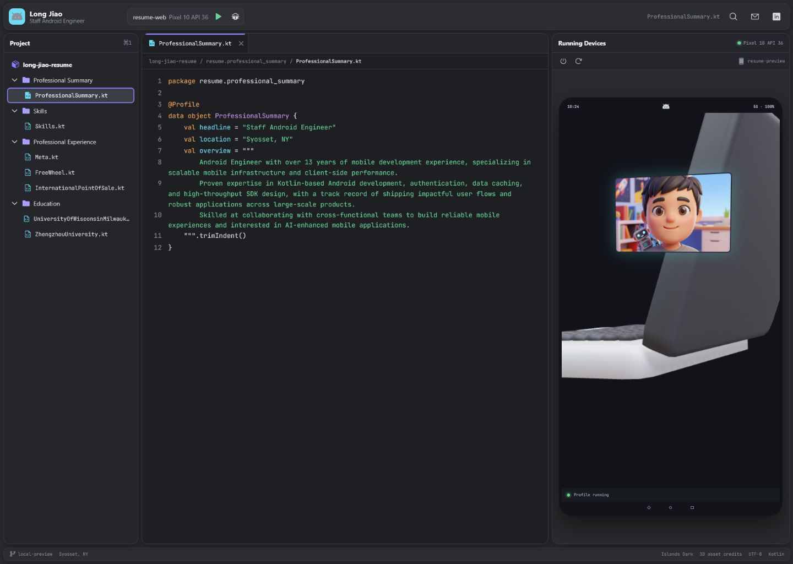

# Long Jiao — Staff Android Engineer

An interactive résumé presented as an Android Studio workspace. Browse résumé
sections through the project tree, read Kotlin-styled files in the editor, and
use the Android Emulator panel to explore an animated laptop, profile display,
and skill, employer, and education stickers.

[View the live résumé](https://johnwan.github.io/long-jiao-resume/)



## Highlights

- Android Studio-inspired Islands Dark and Islands Light themes
- System theme detection plus a manual theme selector
- Expandable project packages, editor tabs, keyboard navigation, and hash routes
- Interactive React Three Fiber laptop scene with skill and résumé-state animations
- Responsive desktop, tablet, and mobile layouts
- Reduced-motion and WebGL fallback support
- Static GitHub Pages deployment with no backend, analytics, cookies, or forms

## Local development

Requires a current Node.js LTS release.

```bash
npm ci
npm run dev
```

Open the local URL printed by Vite.

## Validation

```bash
npm test
npm run test:sites
npm run typecheck
npm run build
npm run preview
```

The production website is written to `dist/client`.

## Technology

React, TypeScript, Vite, React Three Fiber, Drei, Three.js, Framer Motion,
Phosphor Icons, Vitest, Testing Library, and JetBrains Mono.

## Assets

See [CREDITS.md](CREDITS.md) for model, avatar, and sticker attribution.

This public repository does not include the original résumé PDF or a phone
number. No open-source license is granted.
